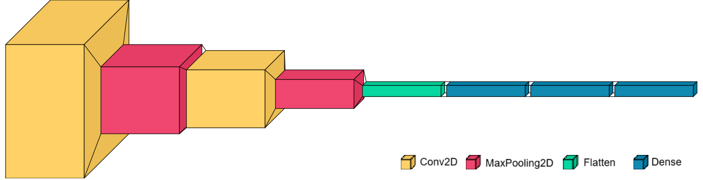
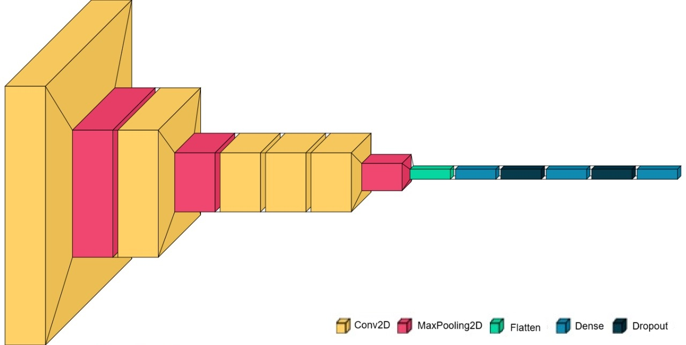
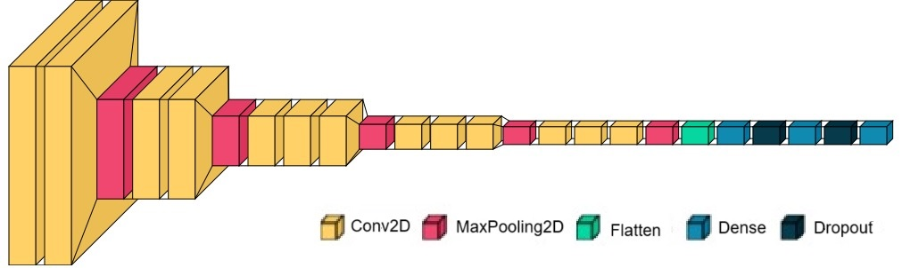
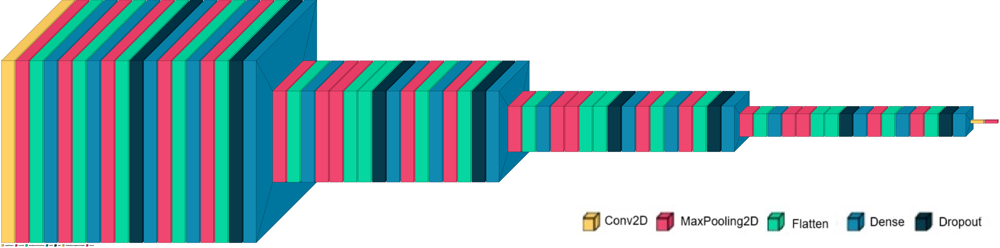

# Traffic Sign Recognition using Convolutional Neural Networks (CNNs)

This repository contains code for training and evaluating Convolutional Neural Networks (CNNs) on the task of traffic sign recognition. Four different CNN architectures are implemented and evaluated: LeNet-5, AlexNet, VGG-16, and ResNet-18.

## Dataset

The German Traffic Sign Recognition Benchmark (GTSRB) dataset is used for training and testing the models. It contains images of 43 different classes of traffic signs.

## Requirements

- Python 3.x
- PyTorch
- TensorFlow (for visualization purposes)
- scikit-learn
- matplotlib
- seaborn
- pandas
- visualkeras
- Google Colab (for running the notebook)

You can install the required Python packages using the following command:

```
pip install -r requirements.txt
```

## Usage

1. **Data Preparation**:
   - Ensure that you have downloaded the GTSRB dataset and placed it in the appropriate directory (`./data`).
   - The dataset can be downloaded from [here](http://benchmark.ini.rub.de/?section=gtsrb&subsection=dataset).

2. **Training**:
   - Execute the notebook or script for each CNN architecture to train the models.
   - Adjust hyperparameters and training configurations as needed.

3. **Evaluation**:
   - After training, evaluate the trained models using the provided evaluation functions.
   - The evaluation includes generating confusion matrices, classification reports, ROC curves, and calculating mean Average Precision (mAP).

4. **Model Comparison**:
   - Compare the performance of different CNN architectures based on accuracy, computational efficiency, and other metrics.

## Model Architectures

1. **LeNet-5**:
   - A classic CNN architecture with two convolutional layers followed by max-pooling layers and fully connected layers.
   
   
2. **AlexNet**:
   - A deeper CNN architecture compared to LeNet-5, introduced in the AlexNet paper by Krizhevsky et al. It consists of several convolutional and max-pooling layers followed by fully connected layers.
   

3. **VGG-16**:
   - A deeper architecture characterized by a stack of convolutional layers with small 3x3 filters, followed by max-pooling layers and fully connected layers.
   

4. **ResNet-18**:
   - A CNN architecture with residual connections, addressing the vanishing gradient problem in deeper networks. It consists of several residual blocks, each containing convolutional layers with identity shortcuts.
   

### Results Analysis

- In all cases, the models were trained using the Adam optimizer with a learning rate of 0.001 for 30 epochs on Google Colab.

- **LeNet-5**:
  - Accuracy: 87.80%
  - Trainable Parameters: 0.34 M
  - FLOPs: 3.91 M
  - Discussion: LeNet-5 demonstrated competitive performance with a relatively simple architecture, making it suitable for resource-constrained environments.

- **AlexNet**:
  - Accuracy: 77.98%
  - Trainable Parameters: 57.1 M
  - FLOPs: 764 M
  - Discussion: Despite its deeper architecture, AlexNet exhibited lower accuracy, possibly due to overfitting or optimization hyperparameters.

- **VGG-16**:
  - Accuracy: 95.4%
  - Trainable Parameters: 4.5 M
  - FLOPs: 16 G
  - Discussion: VGG-16 demonstrated the highest accuracy, indicating its effectiveness in capturing complex features but at the cost of increased computational resources.

- **ResNet-18**:
  - Accuracy: 95.39%
  - Trainable Parameters: 11 M
  - FLOPs: 2 G
  - Discussion: ResNet-18 achieved competitive accuracy with moderate computational resources, thanks to its residual connections.

- Overall, VGG-16 and ResNet-18 outperformed LeNet-5 and AlexNet in terms of accuracy. However, they require significantly more computational resources.

### Conclusion

In conclusion, the choice of CNN architecture for traffic sign recognition depends on a trade-off between accuracy and computational efficiency. While LeNet-5 and AlexNet are suitable for resource-constrained environments, VGG-16 and ResNet-18 offer higher accuracy at the cost of increased computational resources.

For scenarios prioritizing accuracy without significant constraints on computational resources, VGG-16 or ResNet-18 are preferred choices. Alternatively, for applications where computational efficiency is paramount, simpler architectures like LeNet-5 or possibly modified versions of AlexNet could be considered.

The evaluation highlights the importance of selecting an appropriate CNN architecture based on the specific requirements and constraints of the task.

## License

This project is licensed under the MIT License - see the [LICENSE](LICENSE) file for details.

---